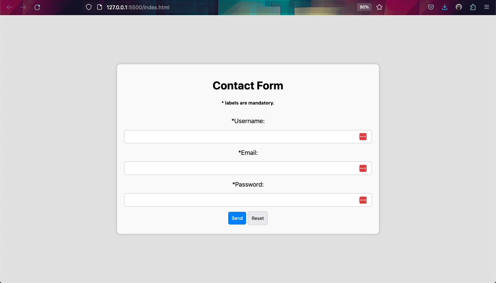

# Form Validation in JavaScript

This is a simple example of a form validation script using JavaScript. When a user submits the form, the script checks the input fields for various conditions and displays error messages.

## Screenshot

## Features

- Validates username, email, and password fields.
- Provides error messages for invalid inputs.

## Getting Started

1. Clone this repository to your local machine or download the source code.
2. Open the `index.html` file in your web browser with Live Server.

## Usage

- The `validateForm()` function checks the form fields for validation.
- If an input is invalid, it displays an error message.
- You can customize the validation rules and error messages in the JavaScript code.
- The `resetErrors()` function clears inputs and error messages.

## Customization

You can customize this script by modifying the JavaScript code in the `app.js` file:

- Update the validation rules in the `validationRules` object.
- Customize error messages in the `getErrorMessage` function.

## Contributing

Feel free to contribute to this project by opening issues or submitting pull requests.

## License

This project is licensed under the MIT License - see the [LICENSE.md](LICENSE.md) file for details.
